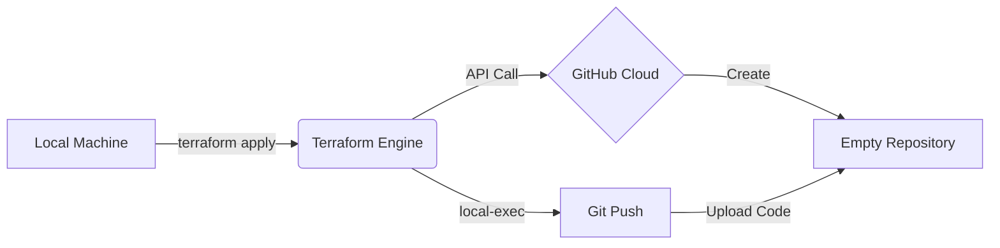

# 🚀 Terraform Auto-Deploy: Infrastructure as Code

> **"This repository didn't exist 5 minutes ago. It was created and populated automatically via code."**

## 📖 About The Project

This project demonstrates a unique **DevOps workflow** where Terraform is used not only to provision infrastructure (creating the GitHub Repository) but also to **bootstrap the application code** (Git init, commit, and push) in a single command.

It bridges the gap between **Infrastructure Provisioning** and **Application Deployment**.

### 🌟 Key Features

- **Zero-Click Repo Creation:** Terraform calls the GitHub API to create the repository.
- **Automated Git Push:** Uses `local-exec` provisioners to initialize Git and push the frontend code immediately.
- **Modern UI:** A clean, dark-mode HTML/CSS dashboard explaining the architecture.

---

## ⚙️ How It Works

The `main.tf` script performs two distinct actions in sequence:

1.  **Phase 1: Provisioning** Uses the `github` provider to create a new public repository on your GitHub account.
2.  **Phase 2: Bootstrap ( The "Hack" )** Uses a `null_resource` with a `local-exec` provisioner to execute shell commands on the local machine. It initializes git, adds the remote origin of the _just-created_ repo, and pushes the `main` branch.

